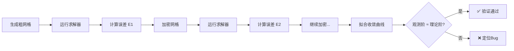

# MMS测试：工业CFD软件验证的方法论与实践

> 面向工业软件开发工程师的技术总结

---

## 术语表

| 术语 | 英文 | 定义 |
|:-----|:-----|:------|
| 验证 | Verification | 判断代码是否正确实现了数学模型（"Are we solving the equations right?"） |
| 确认 | Validation | 判断模型是否准确描述了真实世界（"Are we solving the right equations?"） |
| 制造解 | Manufactured Solution (MMS) | 人为构造的已知解析解，用于验证代码实现的正确性 |
| 观察阶 | Observed Order of Accuracy | 数值解随网格细化收敛的实测速率，与理论离散阶对比判断实现是否正确 |
| 源项 | Source Term | 制造解代入 PDE 后解析推导产生的附加项，作为求解器的已知输入 |

> **重要区分**：本文通篇讨论的是**验证（Verification）**——判断代码是否正确实现了数学模型。这与**确认（Validation）**——判断模型是否准确描述了真实世界——是 ASME V&V 20 中明确区分的两个概念。MMS 是验证的工具，不是确认的工具。

---

## 一、为什么需要MMS？

### 1.1 核心问题

写了一个 CFD/CAE 求解器，怎么知道代码的实现**没有 Bug**？这并不是一个哲学问题，而是一个现实的工程问题。工业仿真软件的 Bug 可能导致飞机设计基于错误的升力系数、核反应堆冷却方案基于错误的热通量、汽车碰撞安全基于错误的变形数据。

工业软件（尤其是 CAE/CFD 类）的复杂性使得传统验证手段面临根本性困境：

| 验证手段 | 局限性 |
|:---|:---|
| **解析解对比** | 能求出解析解的问题极其有限，多为简化几何与边界，无法覆盖真实复杂度 |
| **实验对比** | 实验误差不可控，无法区分"物理模型误差"与"数值离散误差"，且成本高、不可重复 |
| **单元测试** | 只能测试单个函数的逻辑，无法验证 PDE 离散化的整体正确性 |
| **基准测试** | 基准只测试特定场景（FDA 喷嘴、方形空腔流等），无法覆盖全部代码路径。误以为"基准通过 = 代码正确"是常见认知陷阱 |
| **与其他软件对比** | 其他软件也可能有 Bug，没有"标准答案" |

### 1.2 MMS 的诞生

1978 年，Patrick Roache 将制造解方法系统化为代码验证框架。其核心思想反直觉但有力：

> **为什么一定要知道精确解？我们可以自己"制造"一个！**

这就是 Method of Manufactured Solutions（制造解方法）的核心——**不需要精确解，而是先选一个任意函数，让它满足 PDE，然后验证代码能否复现它。**

**MMS 的核心价值在于**：它将验证问题转化为一个**自洽的数学闭环**，使得任意复杂度的 PDE 求解器都能被系统地、定量地验证其离散精度。这正是工业软件质量保障中"单元测试"在偏微分方程数值求解领域的等价物。

MMS 被 ASME V&V 20-2009（《计算流体力学与传热验证与确认标准》）和 ASME V&V 10-2019（《计算固体力学验证与确认标准》）列为代码验证的核心方法。Sandia 国家实验室要求其所有高后果（high-consequence）仿真软件必须通过 MMS 验证。

### 1.3 MMS 能发现什么

| Bug 类型 | 传统测试 | MMS |
|:---------|:--------:|:---:|
| 边界条件实现错误 | ❌ 可能漏检 | ✅ 必现 |
| 源项计算错误 | ❌ 可能漏检 | ✅ 必现 |
| 离散格式实现错误 | ❌ 难以发现 | ✅ 观察阶异常 |
| 网格拓扑处理错误 | ❌ 偶发 | ✅ 收敛曲线异常 |
| 分区边界通量交换错误 | ❌ 单元测试难覆盖 | ✅ 串并行结果不一致 |
| 浮点精度问题 | ❌ 偶发 | ✅ 观察阶偏离 |

> 分区边界通量交换错误：并行计算时，子域之间的 ghost cell 数据交换未正确实现，导致串行结果与并行结果不一致。MMS 在并行下能稳定复现此类问题。串并行一致性验证的具体方法是：在相同网格上分别以串行（np=1）和并行（np=4/8）运行 MMS 测试，比较两组 L2 误差——若一致（差异 < 1e-12）则分区边界实现正确，若不一致则 ghost cell 交换或通量累加存在 Bug。

### 1.4 工业标准要求

| 标准 | 要求 | 适用范围 |
|:-----|:------|:---------|
| **ASME V&V 20-2009** | 代码验证必须执行，MMS 为首选方法 | CFD/传热 |
| **ASME V&V 10-2019** | 各级别验证推荐 MMS | 固体力学 |
| **ISO 17534-1:2015** | 噪声软件需验证精度阶数 | 声学 |
| **FDA Critical Path Initiative** | 医疗器件仿真需经过验证确认流程 | 医疗仿真 |
| **Sandia National Labs** | 高后果软件必须通过 MMS 验证 | 核安全 |

### 1.5 工业应用价值

```
研发阶段：    在代码上线前发现离散化错误，避免带着 Bug 开发半年
CI 门禁：     每次提交自动运行，防止精度退化
回归测试：    代码重构后确保精度阶数不变
技术债评估：  未通过 MMS 的模块自动标记为高风险
合规性：      MMS 验证记录是 ASME V&V 认证审核的必备材料，
              直接影响高后果工业软件的产品市场准入
```

> **管理视角**：对于需要通过 ASME V&V、ISO 等标准认证的工业软件，MMS 提供的系统验证记录不仅是技术需要，也是合规性要求——直接关系到产品的市场准入门槛。

---

## 二、MMS的数学原理

### 2.1 基本设定

考虑一个一般的偏微分算子 \(\mathcal{L}\)，控制方程为：

\[
\mathcal{L}(u) = 0, \quad x \in \Omega, \quad \text{with B.C. on } \partial\Omega
\]

### 2.2 逆向构造（核心思想）

与传统"给定方程→求解→得解"的正向流程相反，MMS执行逆向操作：

```
传统方法：已知精确解 → 求解器计算 → 对比误差
MMS 方法：先选任意函数 → 算出源项 → 让求解器解带源项的 PDE → 对比

关键区别：MMS 不依赖"有精确解的简单问题"，可以对任意复杂的代码做验证
```

**步骤 1**：任意选择一个足够光滑的函数 \(u_{exact}\)，使其满足边界条件。

**步骤 2**：将 \(u_{exact}\) 代入算子 \(\mathcal{L}\)，解析计算出对应的源项：

\[
S(x) = \mathcal{L}(u_{exact})
\]

> 推荐使用 SymPy / Mathematica 等符号计算工具辅助推导，手算混合偏导项极易出错。

**步骤 3**：用数值求解器计算带源项的问题：

\[
\mathcal{L}(u_{num}) = S(x)
\]

**步骤 4**：在多套网格上比较 \(u_{num}\) 与 \(u_{exact}\)，计算误差范数。

**步骤 5**：验证收敛阶。

### 2.3 收敛阶的理论基准

若数值格式具有 \(p\) 阶精度，则离散误差满足：

\[
||u_{num} - u_{exact}|| = C \cdot h^p + \text{高阶小量}
\]

其中 \(h\) 为特征网格尺寸。对数域中：

\[
\log E = \log C + p \cdot \log h
\]

通过对多套网格的 \((h, E)\) 数据进行线性回归，斜率即为**观测收敛阶**。

**判定逻辑**：
- 观测阶 \(\approx\) 理论阶（如中心差分 → 2） → **验证通过**，离散实现正确
- 观测阶显著偏离理论阶 → **代码存在缺陷**，需排查

> **关于容差**：均匀结构化网格上二阶格式的观察阶通常极为接近 2.0（实测偏差 < 0.01）。文档设定判定阈值 |p_obs - p_theory| ≤ 0.1 → PASS，但实际工程中若偏差 > 0.05 就应高度警惕。不同场景的建议容差：均匀网格 + 二阶格式 ±0.05，扭曲网格 ±0.15，非结构网格 ±0.2~0.3。脚本默认使用 ±0.1，可通过参数配置。

---

## 三、测试算法（完整工作流）

### 3.1 前置准备

| 步骤 | 内容 | 工具/方法 |
|:---|:---|:---|
| **选解** | 构造满足B.C.的光滑函数 | 三角函数、多项式、指数函数组合 |
| **推导源项** | 解析计算 \(\mathcal{L}(u_{exact})\) | 手推 + SymPy/Mathematica 符号验证 |
| **实现源项** | 将 \(S(x)\) 编码为求解器可读形式 | OpenFOAM: `scalarCodedSource`；通用: 函数指针/表达式解析器 |

> **选解原则**：函数只需满足两个条件——足够光滑（至少比 PDE 的最高阶导数多两阶连续可导）和满足边界条件。物理意义不重要。

### 3.2 测试执行



> **网格建议**：最低 3 套网格，推荐 4-5 套（h, h/2, h/4, h/8）。越多的网格层级越能排除网格质量偶然因素，观察阶的计算越可靠。工业实践通常要求 h 方向至少 2-3 个 decade 的细化范围。MMS 假设网格均匀或至少光滑变化，极度扭曲的网格会在离散误差之上叠加额外的几何误差。

### 3.3 关键指标

| 指标 | 定义 | 用途 |
|:---|:---|:---|
| \(L_2\) 误差 | \(\sqrt{\sum (u_{num} - u_{exact})^2 / N}\) | 整体精度评估 |
| \(L_\infty\) 误差 | \(\max|u_{num} - u_{exact}|\) | 捕捉局部异常 |
| 观测收敛阶 | \(\log_2(E_{coarse}/E_{fine})\) | 核心判定依据 |

### 3.4 常见问题

**Q: 制造解需要物理意义吗？**
A: 不需要。MMS 的精髓就是函数可以任意选（只要满足边界条件且足够光滑）。`u = sin(x)·sin(y)` 不是任何物理问题的解，但它可以验证代码是否正确实现了 PDE。

**Q: 怎么处理复杂边界条件？**
A: 制造解代入边界条件，得到边界上的值作为 Dirichlet 边界输入。如果是 Neumann 边界，则计算边界上的法向导数。

**Q: 非线性 PDE 可以用 MMS 吗？**
A: 可以。但制造解代入非线性 PDE 后，源项的解析推导可能包含高阶导数项和混合导数项，**手算极易出错。强烈建议使用 SymPy（Python）、Mathematica 或 Maple 等符号计算工具辅助推导和验证。**

**Q: MMS 能验证"物理正确"吗？**
A: 不能。MMS 验证的是**代码实现是否正确**（"Are we solving the equations right?"），而不是**模型是否正确**（"Are we solving the right equations?"）。后者是**确认（Validation）**的工作。

**Q: MMS 验证通过是否意味着代码完全没有 Bug？**
A: **不是。** MMS 只能验证制造解覆盖的代码路径是否实现正确。未覆盖的代码分支（如时间步进逻辑、湍流模型、特定的边界条件类型）仍可能存在 Bug。MMS 应与单元测试、回归测试、基准测试组合使用，构成完整的验证体系。**MMS 验证通过是必要条件，不是充分条件。**

**Q: MMS 的网格需要满足什么质量要求？**
A: MMS 假设网格均匀或至少光滑变化。**极度扭曲的网格会在离散误差之上叠加额外的几何误差**，使观察阶计算失真。建议使用均匀网格或质量受控的结构化网格。如果必须使用非结构网格，应确保网格质量指标（偏斜率、正交性）在可控范围内。

**Q: MMS 测试过程中需要注意哪些运行指标？**
A: 除了观察阶之外，建议关注以下运行时指标：浮点异常（FPE）——求解器是否触发了除零/溢出？线性求解器迭代次数——是否随网格加密正常增长？残差收敛曲线——是否单调下降？这些问题指标虽然不直接影响 p_obs，但往往是代码缺陷的早期信号。

---

## 四、OpenFOAM中的MMS实现（案例解剖）

### 4.1 控制方程与制造解

**目标方程**（稳态扩散）：

\[
-\nabla \cdot (DT \cdot \nabla T) = S, \quad DT = 1
\]

**制造解**（满足齐次 Dirichlet 边界）：

\[
T_{exact} = \sin(\pi x) \cdot \sin(\pi y), \quad (x,y) \in [0,1]^2
\]

**解析源项**：

\[
S = 2\pi^2 \cdot \sin(\pi x) \cdot \sin(\pi y)
\]

### 4.2 求解器选择的技术决策树

```
需求：求解带源项的稳态扩散方程
    ↓
候选：laplacianFoam
    ↓
检查源码：是否支持 fvOptions（源项注入框架）？
    ↓
    ❌ 不支持（laplacianFoam 不读取 constant/fvOptions）
    ↓
候选：scalarTransportFoam
    ↓
策略：设定 U = (0,0,0)，对流项自动失效，只剩纯扩散
    ↓
    ✅ 支持 fvOptions，可通过 scalarCodedSource 注入空间变化源项
```

### 4.3 关键实现细节与避坑指南

#### 坑1：源项符号约定

OpenFOAM 的 `fvMatrix` 内部约定：

- 数学方程：\(-\nabla^2 T = S\)
- 代码声明：`- fvm::laplacian(T) == fvOptions(T)`
- 内部展开：`A·T = b + S`（fvOptions 默认 `+= S`）
- **正确做法**：若手动操纵 `eqn.source()`，需使用 `-= S` 抵消内部默认添加

**根本原因**：移项约定的差异。数学上将源项写在等号右侧（正号），OpenFOAM 组装矩阵时将右侧所有项移到左侧。

#### 坑2：动态编译权限

- `scalarCodedSource` 需要运行时编译 C++ 代码并 `dlopen` 加载动态库
- **安全限制**：root 用户被禁止执行动态编译（`dynamicCode::checkSecurity`）
- **解决方案**：使用非 root 用户运行，或设置 `OPENFOAM_CODE_ALLOW_ROOT=1`

#### 坑3：版本兼容性

| OpenFOAM 版本 | 源项机制 | 类型名 |
|:---|:---|:---|
| v8 及以前 | fvOptions | `codedSource` |
| v2212 | fvOptions | `codedSource` |
| v2306 ~ v2412 | fvOptions（兼容） + fvModels | `codedSource`（兼容模式） |
| v2512 | fvOptions（兼容） + fvModels | `scalarCodedSource`（类型名变更） |

> 从 v2306 开始，OpenFOAM 将 fvOptions 拆分为 fvModels（源项）和 fvConstraints（约束）。新项目建议逐步迁移至 fvModels 体系。v2512 中 scalarCodedSource 需要 `fields (T)` 和 `name` 两个额外条目，且需要提供 `codeCorrect` / `codeSetValue` / `codeConstrain` / `codeAddSupRHS` 四个空钩子。

#### 坑4：矩阵对称性变化

即使速度场为零，`div(phi,T)` 使用 `Gauss upwind` 格式会导致矩阵被 OpenFOAM 分类为非对称，无法使用 PCG 求解器。需改用 `PBiCG + DILU` 或 `div(phi,T) Gauss linear`。

### 4.4 实测结果

| 网格 | 单元数 | \(h\) | L2 误差 | 加密比 | 观察阶 |
|:---|:------:|:-----:|:-------:|:------:|:------:|
| coarse | 20×20 | 0.05 | 1.03e-03 | — | — |
| medium | 40×40 | 0.025 | 2.57e-04 | ≈ 4× | **2.001** |
| fine | 80×80 | 0.0125 | 6.43e-05 | ≈ 4× | **2.000** |

**结论**：观测收敛阶 \(p = 2.001\)，与理论二阶精度完全一致。误差每加密一倍缩小约 4 倍，验证通过。✅

### 4.5 一键运行

```bash
cd docs/zh/mms
python3 openfoam_laplacian_mms.py
```

预期输出：
```
coarse -> medium: p_obs = 2.001  [PASS]
medium -> fine:   p_obs = 2.000  [PASS]
Average observed order: 2.001
Overall result: [PASS]
```

> 该脚本基于 OpenFOAM 2512 开发。v2306 以下版本需将 `scalarCodedSource` 改为 `codedSource`。v2306 及以上推荐逐步迁移至 `fvModels` 体系。

### 4.6 与验证案例库的集成

MMS 验证结果对应《数值算法正确性与精度保障评估验证案例集》中的：

| 规则 | 名称 | 阴性验证 |
|:-----|:------|:---------|
| **NVR-005** | MMS 验证缺失 | 通过 MMS → 规则不触发（反向阴性） |
| **NVR-006** | 观察阶偏差 | 观察阶 2.0 ± 0.1 → 规则不触发 |

验证通过后，代码模块的 NVR-005 和 NVR-006 应标记为"阴性通过"。在数值算法精度评估的综合评分中，验证完备性维度的得分从 0 提高到 100。

### 4.7 扩展计划

| 求解器 | PDE | 制造解 | 理论阶 | 难度 |
|:-------|:-----|:--------|:------:|:----:|
| `laplacianFoam` → `scalarTransportFoam` | 稳态扩散 | `sin(πx)·sin(πy)` | 2 | ⭐ |
| `simpleFoam` | 稳态 NS | 多项式速度场 | 2 | ⭐⭐⭐ |
| `rhoCentralFoam` | 可压缩流 | 正弦波（亚声速） | 1 | ⭐⭐⭐⭐ |
| `solidDisplacementFoam` | 线弹性 | 多项式位移场 | 2 | ⭐⭐⭐ |

> `simpleFoam` 需设置压力参考点（`pRefCell`），否则矩阵奇异。`rhoCentralFoam` 建议从亚声速光滑解开始，避免激波污染收敛阶。多相流求解器需确保制造解满足相分数约束 \(0 \leq \alpha \leq 1\)。

---

## 五、求解器数值算法的工程视角

### 5.1 通用求解器架构

工业 CFD 求解器的核心数据流：

```
┌─────────────────────────────────────────────────────┐
│  输入: 网格 + 边界条件 + 物理属性 + 控制参数        │
└─────────────────────────────────────────────────────┘
                          ↓
┌─────────────────────────────────────────────────────┐
│  时间步/迭代循环:                                    │
│  ┌───────────────────────────────────────────────┐  │
│  │  1. 组装矩阵 (fvm:: 隐式项 → A, fvc:: 显式项 → b)│  │
│  │  2. 施加边界条件 (修正 A 和 b)                  │  │
│  │  3. 调用线性求解器 (PBiCG/GAMG/smoothSolver)   │  │
│  │  4. 更新场量，检查收敛                          │  │
│  └───────────────────────────────────────────────┘  │
└─────────────────────────────────────────────────────┘
                          ↓
┌─────────────────────────────────────────────────────┐
│  输出: 各时间步的物理场 (T, U, p, ...)              │
└─────────────────────────────────────────────────────┘
```

### 5.2 关键设计模式（OpenFOAM视角）

| 设计模式 | 工程意义 | 代码示例 |
|:---|:---|:---|
| **`fvm` vs `fvc`** | 隐式/显式分离，控制数值稳定性与耦合强度 | `fvm::laplacian(DT, T)` 加入矩阵 A；`fvc::grad(T)` 直接计算 |
| **`fvMatrix`** | 封装线性方程组 \(A\cdot x = b\)，统一接口 | `fvScalarMatrix TEqn(...)` |
| **`fvOptions` → `fvModels`** | 源项插件框架，支持运行时动态注入 | `scalarCodedSource` |
| **模板化** | 标量/矢量/张量场统一处理 | `GeometricField<Type, ...>` |

### 5.3 线性求解器的选择逻辑

| 矩阵特性 | 推荐求解器 | 预处理器 |
|:---|:---|:---|
| 对称正定（压力泊松） | PCG | DIC/GAMG |
| 非对称（动量方程） | PBiCG | DILU |
| 高度病态（大规模 3D） | GAMG | 多网格预条件 |

---

## 六、工程师实践建议

### 6.1 排查失败的一般策略

当观测收敛阶偏离理论值时，按以下优先级排查：

1. **符号错误**：检查源项、边界条件的正负号（最高频错误）
2. **边界条件**：确认制造解是否精确满足设定的 B.C. 类型
3. **离散格式**：检查 `fvSchemes` 中是否混用了不匹配的格式
4. **线性求解器容差**：求解器容差是否远小于离散误差（建议 `1e-8` 以下）
5. **浮点异常**：检查是否存在除零或大数相消

### 6.2 将MMS集成到CI/CD流水线

```bash
# 每日回归测试脚本结构
daily_regression.sh:
├── 拉取最新代码
├── 编译所有求解器
├── 对每个求解器执行MMS验证
│   ├── laplacianFoam_MMS
│   ├── simpleFoam_MMS
│   └── rhoCentralFoam_MMS
├── 检查收敛阶是否在 [p-0.1, p+0.1] 区间
└── 发送测试报告（通过/失败 + 收敛阶趋势图）
```

> **CI 时间控制策略**：MMS 在 80×80 网格上单次需 1-2 分钟，扩展到多个求解器后时间线性增长。建议分层策略——fast-check（仅粗网格，秒级完成，检测运行不崩溃）、标准验证（3 套网格计算 p_obs，1-2 分钟）、全量回归（4-5 套网格 + 多求解器，10-15 分钟，建议 nightly 执行）。

### 6.3 实施路线

| 阶段 | 内容 | 状态 |
|:-----|:------|:----:|
| **Phase 0** | **团队培训 + 试运行**——先在一个简单求解器上跑通全流程，建立信心 | ⭐ P0 优先 |
| **Phase 1** | 稳态扩散 MMS 验证脚本 + 文档 | ✅ 已完成 |
| **Phase 2** | WSL/Linux 环境安装 OpenFOAM + 运行验证 | ✅ 已完成 |
| **Phase 3** | 扩展至 simpleFoam、rhoCentralFoam 等求解器 | 📅 后续迭代 |
| **Phase 4** | CI 集成：每次提交自动 MMS 回归 | 📅 长期目标 |
| **Phase 5** | MMS 回归测试自动化——CI/CD 流水线集成，自动生成验证报告 | 📅 长期目标 |

### 6.4 完整的验证体系

MMS 是代码验证的强有力工具，但它不是万能的。**MMS 验证通过 = 制造解覆盖的代码路径实现正确 ≠ 全部代码无 Bug。** 完整的代码验证体系应包含：

| 方法 | 验证内容 | 与 MMS 的关系 |
|:-----|:---------|:-------------|
| **单元测试** | 单个函数/模块的正确性 | 互补——覆盖 MMS 无法覆盖的代码分支 |
| **MMS 验证** | PDE 离散化的整体正确性 | 核心——验证数值算法的数学实现 |
| **基准测试** | 在标准算例上对比参考解 | 互补——验证物理模型的实际效果 |
| **回归测试** | 防止代码修改引入退化 | 互补——持续监控精度变化 |

---

## 七、总结：MMS在工业软件开发生命周期中的定位

```
需求规格 → 架构设计 → 代码实现 → [单元测试] → [集成测试] → 交付
                                      ↑
                                    MMS验证
                            （PDE求解器的"单元测试"）
```

MMS 是工业 CFD 软件质量保障体系中**不可替代**的一环。它将数值方法的验证从"定性判断"提升为"定量度量"，为以下关键决策提供数据支撑：

- 代码变更是否引入了回归缺陷
- 新开发的离散格式是否达到了设计精度
- 不同求解器实现之间的一致性校验

对于有志于工业软件开发的工程师，掌握 MMS 方法论意味着具备了**系统性验证复杂数值软件**的能力——这不仅是技术技能，更是工程成熟度的标志。

### 本文参考资料

- ASME V&V 20-2009, Standard for Verification and Validation in Computational Fluid Dynamics and Heat Transfer
- ASME V&V 10-2019, Standard for Verification and Validation in Computational Solid Mechanics
- Roache, P. J., Verification and Validation in Computational Science and Engineering, Hermosa Publishers, 1998
- OpenFOAM v2512 User Guide, Chapter 3: fvOptions and fvModels
- Salari, K. and Knupp, P., Code Verification by the Method of Manufactured Solutions, SAND2000-1444, Sandia National Laboratories, 2000
